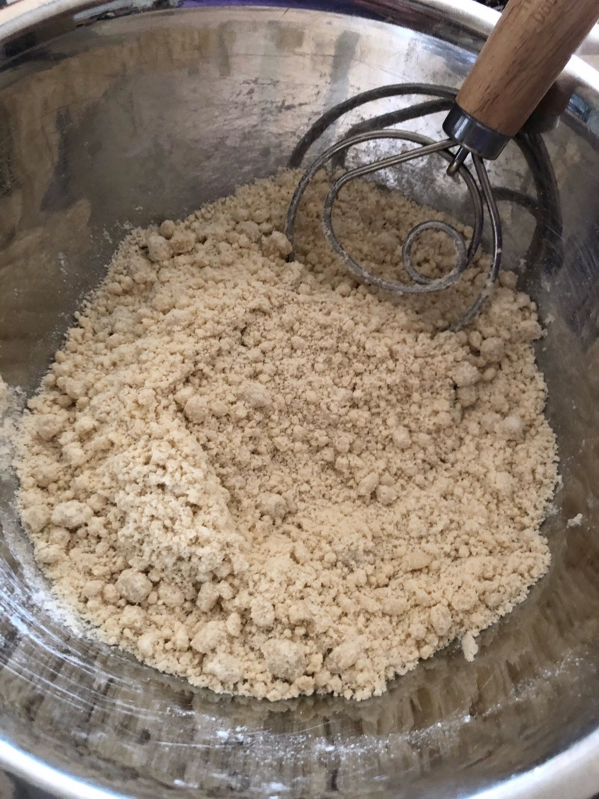

# Kai’s Chicago-style deep-dish pizza

**Total ingredients needed**

1.5c flour (All-purpose or Bread, bread works better. My cup measures 240mL)
1 tsp sugar
1/2 tsp salt
1/2 packet yeast (about 1/8oz)
1/4c olive oil or 4tbsp melted butter
2/3c water
More butter (refridgerated)
Parmesan crumbs/flakes
2 packs of **DRY** Mozzarella cheese (pre-shredded is easiest)
1 giant can or 2 smaller cans of San Marzano (Italian) tomatoes OR chunky marinara sauce (easiest)
More salt
Pepper
Fresh basil (or just use basil flakes)

**Hardware needed**
Large bowl for mixing
Dough whisk or mixer
Rolling pin
Blender/hand blender
Strainer
10-12" skillet that can go into the oven (cast iron works best, though you can substitute with others if you don't have one)

## Dough

Mix 1.5 cups flour, 1 tsp sugar, 1/2 tsp salt, and 1/8 oz yeast in a bowl and mix with whisk/mixer until evenly distributed.

Add 1/4c olive oil or butter (4 tbsp). Mix thoroughly. You should be seeing tiny clumps of dough-oil balls.

This is what it looks like towards the start of mixing:

What it looks like when it's done mixing:

Add ~2/3c water and mix as you add. Slow down towards the end of the pour in case you didn't add that much flour. Mix to the point that dough sticks together in 1 giant clump. If you added all the water and can't get it to 1 clump after a minute of mixing, add a little more (it's never the same for me because I don't have a scale and measure my flour to that precision). You don't want to knead it into a ball just yet though.

Cover and let sit for at least 30m (see: [Autolyse](https://www.kingarthurbaking.com/blog/2017/09/29/using-the-autolyse-method)).

I just cover with plastic wrap + a large plate. Leave a small gap so the yeast can breathe:

What it looks like after 2 hours:

Knead + fold into a dough ball (takes about 30s - 1m). See this video for folding technique: [How to shape dough balls](https://www.youtube.com/watch?v=v5t5MEZt6LM).

Cover and give time for dough to rise (1h+, ideally 2hrs). Afterwards you can use or store in fridge (keeps for a few days. I havent tried past 3 days but supposedly it can be up to a week).

What my dough looks like after 2 hrs:

During this time you can prep the other ingredients.

## Prep: Cheese

Not much to say here. You want 2 cheeses: Mozzarella and Parmesan.

The Mozzarella needs to be of the dry variety. If you use the fresh/wet kind, you'll have to use up a wad of paper towels to soak up the water that comes out after the pizza's done. Pre-shredded is easiest, though freshly grated tastes best. If you buy the pre-shredded, buy 2 packs. The pizza needs a ton of cheese.

The parmesan can be shredded or crumbled, though crumbled works best. You can see in the photos that I shredded mine.

## Prep: Meat

Italian sausage is usually what goes in a Chicago-style, though you can substitute with anything. I just bought the store variety.

## Prep: Sauce

This arguably takes the most effort out of anything in this recipe.

The easy way out of doing all the work to prepare the sauce is to just use chunky marinara sauce. It gets you maybe 80% of the way there.

If you want to have legit sauce however, it involves the following (and takes 20m):

1. Buy a giant can of San Marzano (Italian) tomatoes:

1. Drain the tomatoes (You want to get rid of as much liquid as possible).

1. Blend the tomatoes. Then strain (blending will reveal a lot more liquid).

1. Mix in: salt, pepper, fresh basil or basil flakes.

The leftover sauce should look like this (there is a lot less volume compared to what we started with):

## Making the Pizza

Preheat your oven to 425F. While it's heating up...

Flatten the dough with rolling pin on a large surface. You won't need additional flour, as the oil in the dough prevents it from sticking. Dough should be about 1cm thick and the diameter should be about 2-3" larger than the bottom of the pan.

Thoroughly butter the bottom and sides of pan.

**Optional (but delicious)**: Dust the bottom and sides of pan with parmesan flakes/crumble.

Transfer the dough to the pan. The easiest way is to use your rolling pin to wrap the dough around the pin.

Lay the dough into the pan and spread evenly along bottom and sides.

**Layer ingredients into pan:**

Add the cheese evenly:

Then the sausage as one contiguous layer. I made mine about 1cm thick.

Then add the sauce. Use a large spoon to even it out. Afterwards, add more parmesan.

Add pizza to middle rack of oven, bake for 40m.

**For a crispier crust:**
Before putting it in the oven, first set skillet on the stove and heat on medium heat for 5-8m. The oven then only needs to take 30m.

Voíla! You are done. You can serve directly from the pan, or optionally slide the pizza out of the pan onto another surface for easier cutting of slices.

